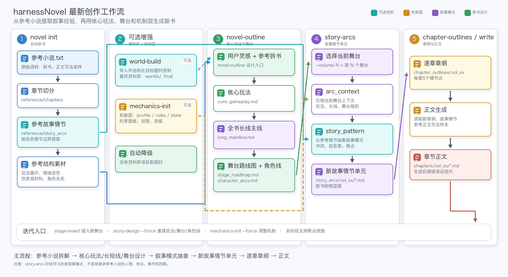

<p align="center">
  
  &nbsp;&nbsp;
  
</p>

<h1 align="center">AI Agent for Long-form Web Novel Writing</h1>

<h2 align="center">Long-form Web Novel Writing AI Agent</h2>

<div align="center">

[](https://www.python.org/)
[](LICENSE)

</div>

<div align="center">

English | [中文](README.md)

</div>

***

<h3 align="center">Teach AI to truly write good web novels</h3>

<p align="center">
  An AI-assisted tool focused on high-quality web novel creation. Through a two-stage "deconstruct + imitate" workflow, it significantly improves the creative quality of AI-generated fiction.
</p>

***

## Project Background

Most AI novel writing tools currently on the market share several common pain points:

- **Weak worldbuilding**: When relying purely on LLM generation, models struggle to independently build logically consistent, richly detailed, and convincing worlds without enough context.
- **Severe averaging, lack of creativity and distinctive style**: Because models are trained on massive average corpora, they tend to output the "most average" content, leading to flat characters, formulaic plots, and little uniqueness.
- **Lack of professional taste and judgment**: AI training does not clearly define or distinguish good fiction from mediocre fiction, so the generated text may look like a novel while still falling short of excellent fiction.

**harnessNovel's solution: deconstruct first, then imitate.**

Instead of asking AI to create from nothing, harnessNovel first lets it systematically study the essence of an excellent novel, then create new work on a stronger foundation.

## Current Iteration

This iteration focuses on solving unreasonable new-world design when adapting from a reference novel plus user inspiration. The main issue is that designing a new world often lacks supporting target-world materials.

For example, if the reference novel uses a Journey to the West worldview while the new novel uses an Investiture of the Gods worldview, you can add related Investiture of the Gods materials to make the design more reasonable.

New capabilities:

- `world-import`: Optional. Import one or more target-genre material files or directories.
- `world-build`: Optional. Structure imported materials into a sectioned knowledge base for later outline and worldbuilding generation.
- `novel-outline`: If a knowledge base exists, it generates a draft from the reference novel + inspiration, then calibrates the draft with the knowledge base. Without a knowledge base, it directly generates the outline and worldview from the reference novel + inspiration.

## Core Features

**Structured Novel Deconstruction**

Supports multi-granularity deconstruction of excellent web novels, extracting:

- Full-book outline
- Complete worldview settings: rules, factions, systems, background, and more
- Volume outline design
- Chapter-level core summaries
- Key plot pacing and emotional beats

**High-quality Imitative Writing**

Uses deconstruction results as high-quality context, combined with user inspiration, to generate:

- Full-book outline
- Worldview framework
- Volume outlines
- Detailed chapter outlines
- Full text content

**Writing Style & Writing Rules**

Deeply analyzes and distills style features and writing rules from multiple novels, helping remove the "AI flavor" from generated writing.

- Language style: word choice habits, sentence patterns, rhetorical preferences
- Narrative pacing and point-of-view control
- Emotional expression and detail density
- Dialogue style and character voices
- Overall prose conventions

**Flexible LLM Support**

Supports Claude, GPT-4o, DeepSeek, Qwen, and other mainstream models.

## Workflow

1. **Deconstruction stage**: Choose a high-quality novel and deconstruct it into structured knowledge with one command.
2. **Imitation stage**: Input your core inspiration + deconstruction results, then let AI create while "standing on the shoulders of giants."
3. **Iterative refinement**: Adjust outlines, worldbuilding, and chapter content at any time to gradually improve the work.

<p align="center">
  
</p>

## Features

- **End-to-end automation**: From novel analysis to full text generation, complete a long-form web novel with 5 commands.
- **Reference-based imitation**: Generate new content based on the pacing, structure, and tension curve of the reference novel instead of creating from nothing.
- **Target-world knowledge base (optional enhancement)**: Import target-genre materials/settings/sample web novels, structure them into a knowledge base, and use it to validate the new outline and worldview. Without a knowledge base, the workflow automatically falls back to reference novel + user direction.
- **Rewrite contamination prevention**: Generate a rewrite map. Batch summaries, chapter outlines, and full text generation all read hard constraints and run forbidden-term audits.
- **Batch summaries**: One batch per 20 chapters, preserving long-term plot continuity.
- **Progressive worldbuilding**: Full-book worldview -> per-volume worldview, refining settings as the story advances.
- **Resume from breakpoint**: Every stage automatically skips existing output and supports continuing after interruption.

## Requirements

- Python 3.9+
- LLM API: must support an OpenAI-compatible interface, such as DeepSeek, Zhipu GLM, Kimi, etc.

## Installation

```bash
pip install harnessNovel
```

Update:

```bash
pip install --upgrade harnessNovel
```

After installation, the `novel` command is globally available.

## Configuration

```bash
novel config
```

This command automatically creates the global config file `~/.harnessNovel/.env`. Edit it and fill in your API keys:

```ini
# Reference novel batch-summary extraction (flash model recommended for speed and low cost)
DATA_BUILDER_MODEL=deepseek-v4-flash
DATA_BUILDER_BASE_URL=https://api.deepseek.com
DATA_BUILDER_API_KEY=your-api-key

# Imitation auxiliary tasks: worldview extraction (flash model recommended)
ADAPTIVE_BUILDER_LITE_MODEL=deepseek-v4-flash
ADAPTIVE_BUILDER_LITE_BASE_URL=https://api.deepseek.com
ADAPTIVE_BUILDER_LITE_API_KEY=your-api-key

# Imitation core tasks: outline, volume outline, chapter outline, full text (pro model recommended for quality)
ADAPTIVE_BUILDER_MODEL=deepseek-v4-pro
ADAPTIVE_BUILDER_BASE_URL=https://api.deepseek.com
ADAPTIVE_BUILDER_API_KEY=your-api-key
```

You can also override these settings with environment variables of the same names. The three config groups can use different models and providers.

## Quick Start

```bash
# 1. Initialize a workspace
#    Automatically deconstructs the reference novel: chapter splitting -> batch summaries -> smart volume splitting -> reference worldview extraction
novel init my-new-novel --txt /path/to/reference-novel.txt

# 2. Optional: import materials for new-novel worldview design. Multiple files can be imported.
novel world-import my-new-novel doc1.txt
novel world-import my-new-novel doc2.txt

# 3. Optional: structure the target-world knowledge base. --primary specifies the main source.
novel world-build my-new-novel --primary doc1.txt

# 4. Generate the new novel outline + full-book worldview
#    With a knowledge base, this first drafts the outline and then calibrates it with the target-world knowledge base.
#    Without a knowledge base, the calibration step is skipped automatically.
novel novel-outline my-new-novel --direction "inspiration input"

# 5. Generate volume outline + per-volume worldview
novel volume-outline my-new-novel --volume 1

# 6. Generate batch summaries + chapter outlines
#    This first adapts reference batches, then generates new batch summaries and audits old-world residue.
novel chapter-outlines my-new-novel --volume 1

# 7. Generate full text
novel write my-new-novel --volume 1 --start 1
```

For an existing workspace, rebuild the knowledge base or overwrite old output with the new rules:

```bash
novel world-build my-new-novel --force --primary doc1.txt --chapter-batch-size 20
novel novel-outline my-new-novel --force --direction "inspiration input"
novel volume-outline my-new-novel --volume 1 --force
novel chapter-outlines my-new-novel --volume 1 --force
```

## Notes

- Reference novels currently only support `.txt` format and must use UTF-8 encoding.

## Command Reference

| Command                                                               | Description                                      |
| --------------------------------------------------------------------- | ------------------------------------------------ |
| `novel config`                                                        | Initialize the global config file                |
| `novel list`                                                          | List all workspaces                              |
| `novel init <ws> --txt <path> [--batch-size N]`                       | Create a workspace and automatically deconstruct the reference novel + extract worldview |
| `novel world-import <ws> <paths...> [--force]`                        | Import target-genre material files or directories |
| `novel world-build <ws> [--force] [--merge-only] [--primary NAME] [--chapter-batch-size N] [--chunk-size N] [--max-workers N]` | Structure target-genre materials into a sectioned knowledge base |
| `novel novel-outline <ws> [--direction TEXT] [--direction-file PATH]` | Generate the new novel outline and full-book worldview |
| `novel volume-outline <ws> [--volume N] [--force]`                    | Generate volume outline and per-volume worldview |
| `novel chapter-outlines <ws> [--volume N] [--force]`                  | Two-stage generation: batch summaries -> chapter outlines |
| `novel write <ws> [--volume N] [--start N] [--max N]`                 | Generate full text serially                      |

### Parameters

- `--txt <path>`: Reference novel file path. Used only by `init`.
- `--batch-size N`: Chapters per processing batch. Default: 20. Used only by `init`.
- `--direction TEXT`: Creative direction, for example "change to a modern urban setting". Used only by `novel-outline`.
- `--direction-file PATH`: Read creative direction from a file. Used only by `novel-outline`.
- `--chapter-batch-size N`: Number of chapters per batch for chapter-like materials. Default: 20. Falls back to character chunks when chapters cannot be detected. Used only by `world-build`.
- `--chunk-size N`: Target-genre material chunk size in characters. Default: 12000. Used only by `world-build`.
- `--max-workers N`: Compatibility parameter. The current `world-build` uses all-section summarization and usually does not need this.
- `--primary NAME`: Specify the main source for `world-build`. Accepts file name, path, or material ID. If omitted, the largest file is used by default.
- `--merge-only`: Rebuild only `worlds/_final/*.md` and audits from existing `worlds/<source>/*.md`; does not re-extract cards.
- `--volume N`: Volume number. Default: 1.
- `--start N`: Starting chapter number. Default: 1. Used only by `write`.
- `--max N`: Maximum number of chapters to generate. Used only by `write`.
- `--force`: Force regeneration and overwrite existing content.

## About the Author

飞鸟 one the way — Explorer

<p align="left">
  
</p>

## Star History

<a href="https://www.star-history.com/?repos=XTmingyue%2FharnessNovel&type=date&legend=top-left">
 <picture>
   <source media="(prefers-color-scheme: dark)" srcset="https://api.star-history.com/chart?repos=XTmingyue/harnessNovel&type=date&theme=dark&legend=top-left" />
   <source media="(prefers-color-scheme: light)" srcset="https://api.star-history.com/chart?repos=XTmingyue/harnessNovel&type=date&legend=top-left" />
   
 </picture>
</a>

## License

[GPL-3.0](LICENSE)
